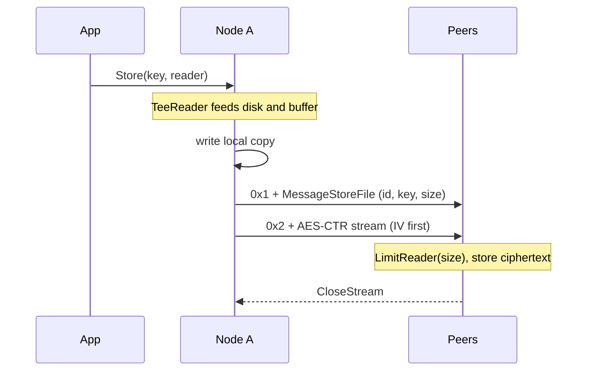
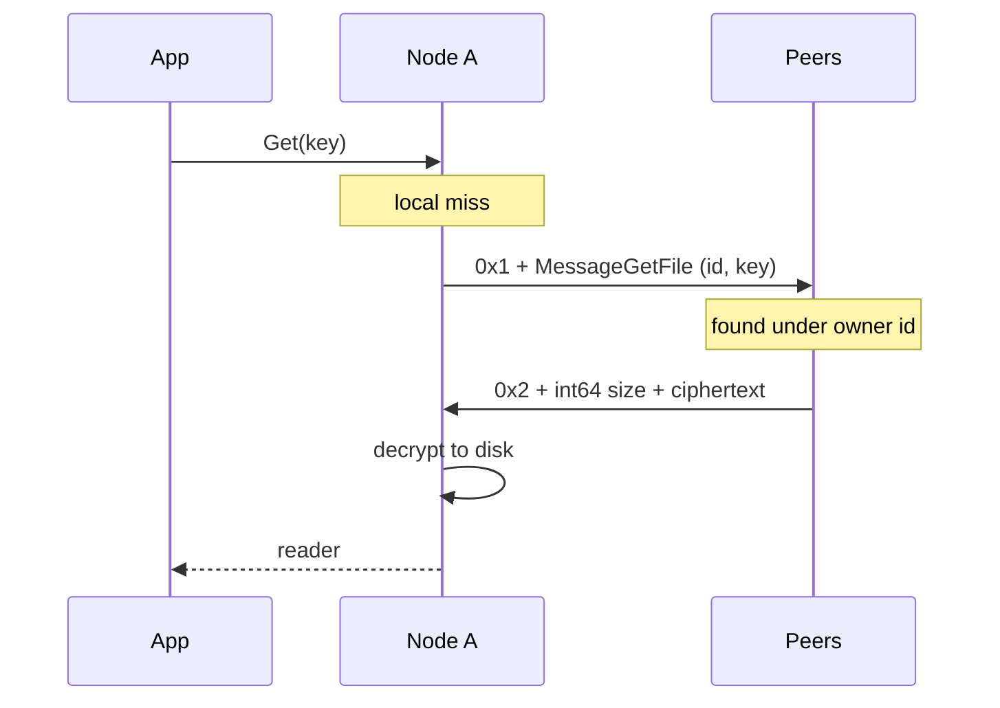

# distfs

A peer-to-peer distributed file store written in Go.

Give a node a key and a stream of bytes. It writes them to its own disk and pushes an
encrypted copy to every peer at the same time. Ask any node for that key later and it
serves it from disk, or fetches it from the network if it does not have it.

No coordinator, no name server, no metadata database. Every node runs the same code, built
on the standard library.

## Features

| | |
| --- | --- |
| **Content addressable storage** | The hash of a key decides where the file lives on disk |
| **Replication on write** | One write reaches every peer, in a single pass over the input |
| **Network retrieval** | A node missing a file goes and finds it |
| **End to end streaming** | Socket straight to file handle, no whole file buffering |
| **Encrypted replicas** | Peers hold ciphertext they cannot read |
| **Pluggable pieces** | Transport, decoder, handshake and path scheme are all interfaces |

## How it works

### Storage layout

`CASPathTransformFunc` takes the SHA-1 of the key, hex encodes it to 40 characters, and cuts
that into eight blocks of five. The blocks become nested directories, the full hash becomes
the filename:

`3000_network/<node-id>/fb994/fe8d2/dee46/dc218/ba3b6/b7d66/8b3cd/ba598/fb994fe8d2dee46...`

This fans out evenly whatever the keys look like, and filenames are always safe to write.
Deletion is cheap too: `Delete` removes the first path segment, taking the file and its
directories together.

### Node IDs

A node's disk holds its own files *and* replicas for other nodes. Two nodes both using the
key `avatar` would collide.

So every path is `Root/<id>/<hashed path>`, where the id is a random 32 byte value generated
at startup. The id travels with the data: `MessageStoreFile` carries the originator's id, and
receivers write the replica under *that* id, not their own. Owner id plus hashed key is the
address, and it means the same thing on every machine. No lookup table needed.

### Wire protocol

One TCP connection carries two very different things: small control messages, and file
payloads of any size. A loop calling `gob.Decode` cannot tell where a file body starts.

Every send is prefixed with one byte:

| Byte | Meaning |
| --- | --- |
| `0x1` | A gob encoded control message follows |
| `0x2` | A raw stream follows |

`DefaultDecoder` reads that single byte. On `0x2` it sets `RPC.Stream` and returns without
touching the body, leaving the payload in the socket for the application layer.

### Stream handoff

Leaving the body in the socket means the transport's read loop must not keep reading, or it
will parse file content as messages. But the code that wants those bytes runs on a different
goroutine.

`TCPPeer` holds a `sync.WaitGroup`. On a stream RPC the read loop calls `wg.Add(1)` then
`wg.Wait()`, parking itself. The peer embeds `net.Conn`, so it is already an `io.Reader` and
gets handed straight to the application. When the handler calls `CloseStream()` the read loop
resumes.

The transport never buffers a file, never needs its size, and never guesses where it ends.

### Payload boundaries

Since the application reads the raw socket, it needs to know how many bytes belong to the
transfer. Both directions send the length, at different layers:

| Direction | How the size arrives |
| --- | --- |
| Write | `MessageStoreFile.Size` in the control message, `n + 16` for the prepended IV |
| Read | A little endian `int64` written on the wire just ahead of the body |

Either way the reader wraps the peer in an `io.LimitReader`, so nobody reads past the end of
a transfer.

### Encryption

AES-256 in counter mode, chosen because CTR turns a block cipher into a stream cipher: no
padding, no block alignment, any input length. `copyEncrypt` generates a random 16 byte IV per
transfer and writes it as the first bytes of the output, so the IV travels with the data.

Where plaintext exists matters. The originating node keeps its own copy in the clear, but what
goes over the wire and lands on peers is ciphertext. A peer serving that file back just does an
`io.Copy` of bytes it already holds and never needs the key. Only the requester decrypts.

## Flows

Storing a file, with the local write and the fan-out sharing one pass over the input:



Reading a file the node does not have:



### Peers and bootstrapping

Bootstrap addresses are dialled in their own goroutines, so a dead address never blocks
startup. The transport fires `OnPeer` for both dialled and accepted connections, and the
server stores them in a map keyed by remote address behind a `sync.RWMutex`. The main `loop`
is a single `select` over the RPC channel and a quit channel, so message handling is
serialised on one goroutine.

## Running it

```
make build   # builds to bin/fs
make run     # builds and runs the demo
make test    # go test ./... -v
```

`main.go` starts three nodes on ports 3000, 4000 and 5000, wires them together, then has the
4000 node store a key, delete it locally, and ask for it again. The file comes back off the
network, is decrypted, and is printed.

Each node stores data under a directory named after its port, such as `3000_network`. These
are gitignored.

## Configuration

Done in Go through option structs. No config files or flags.

| Struct | Field | What it controls |
| --- | --- | --- |
| `FileServerOpts` | `StorageRoot` | Root directory for this node's data |
| | `EncKey` | AES key for this node, 32 bytes |
| | `BootstrapNodes` | Addresses dialled on startup |
| | `ID` | Node identity, random when left empty |
| | `PathTransformFunc` | On-disk layout scheme |
| | `Transport` | Network implementation to use |
| `TCPTransportOpts` | `ListenAddr` | Address to listen on |
| | `HandshakeFunc` | Runs on every new connection before use |
| | `Decoder` | Turns bytes on the wire into an `RPC` |
| | `OnPeer` | Called when a connection is established |

See `main.go` for a full node setup.

## Project layout

| Path | What is in it |
| --- | --- |
| `main.go` | Node construction and the three node demo |
| `server.go` | `FileServer`: message types, store and get flows, peer registry, main loop |
| `store.go` | Content addressable disk store, path transforms, streaming read and write |
| `crypto.go` | AES-CTR stream encryption, node IDs, key hashing |
| `p2p/` | Transport and Peer interfaces, TCP implementation, wire framing, decoders, handshake |
| `*_test.go` | Unit tests for the store, the crypto helpers and the transport |

## Credit

The architecture of this project follows Anthony GG's
[Distributed File Storage in Go](https://www.youtube.com/watch?v=bymQakvTY40)
series, built along with and extended while working through it.
